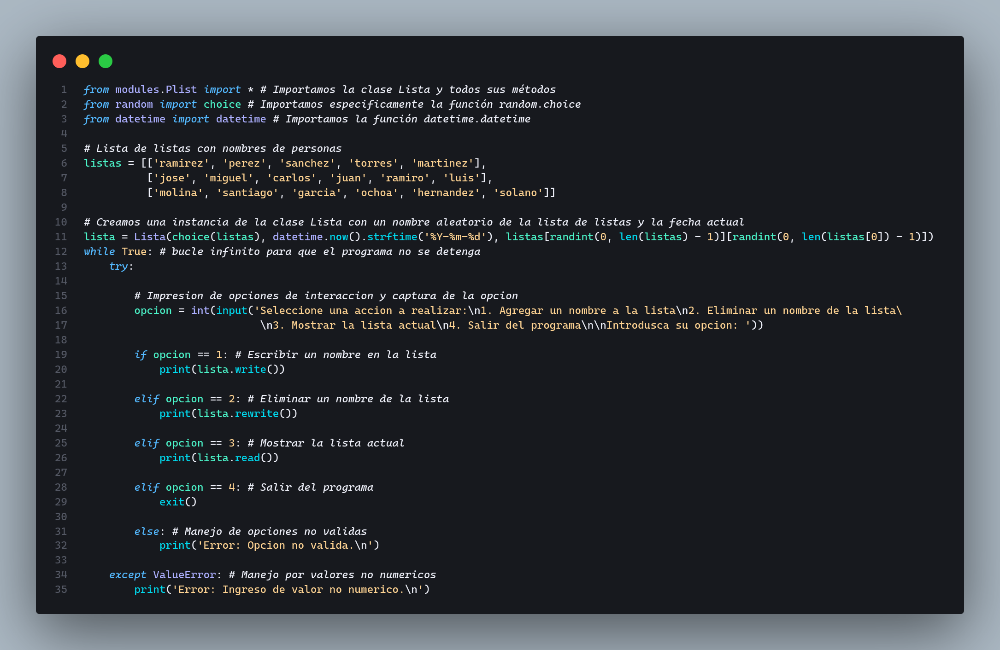
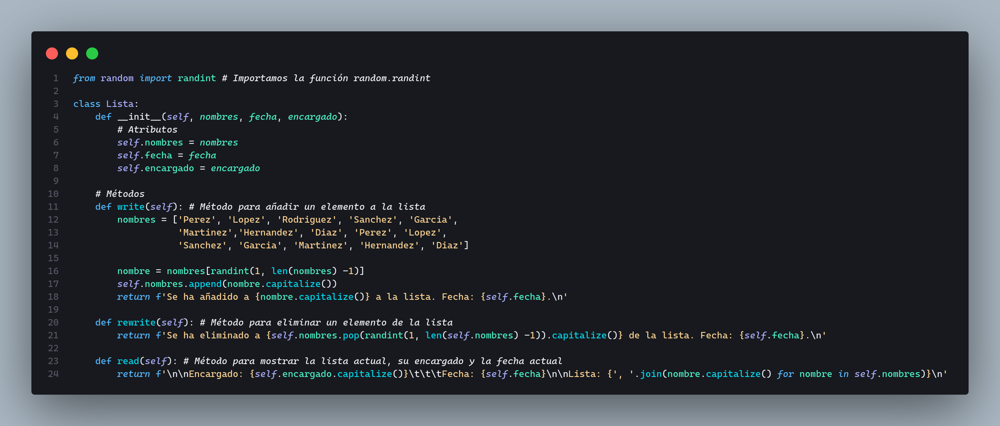

<h1 align="center">Aplicación de conceptos fundamentales del POO</h1>

### Objetivos Específicos:

1. Diseñar una clase con atributos y métodos de acuerdo con una temática propuesta por el estudiante.
2. Crear instancias de la clase (objetos) y manipular sus atributos y métodos.
3. Enviar y recibir argumentos a través de métodos de la clase.
4. Aplicar el concepto de mensajes entre objetos a través de la interacción de métodos

### Instrucciones:

1. Propuesta de Clase:
   - Cada estudiante debe proponer una clase relacionada con una temática de su elección (por ejemplo, Libro, Persona, Producto, etc.).
   - La clase debe tener al menos tres atributos (por ejemplo, para un Libro: titulo, autor, paginas).
2. Implementación de Métodos:
   - Implementar al menos dos métodos en la clase que realicen operaciones sobre los atributos (por ejemplo, un método mostrarDetalles para imprimir los detalles del objeto y un método actualizarAtributo para cambiar el valor de uno de los atributos).
3. Creación y Manipulación de Objetos:
   - Crear al menos dos instancias de la clase propuesta.
   - Modificar los atributos de uno de los objetos utilizando los métodos implementados.
   - Mostrar los detalles de ambos objetos antes y después de las modificaciones.

## Actividad

He propusto, en el archivo `Pmenu.py`, un menu de opciones con el que el usuario pueda escrbir, eliminar o mostar los nombres de una lista. Estas mismas acciones siendo ejecutadas con resultados aleatorios, mediante el importe de `choice` o `randint` del modulo `random` a los codigos. Para ello, se tiene una la clase `Lista`, el archivo `Plist.py`, con los atributos:

- **nombres**: un nombre seleccionado aleatoriamente de una lista de nombres ya definidas en el metodo `write` de la clase Lista.
- **fecha**: la fecha actual dada por la parte del codigo `datetime.now().strftime('%Y-%m-%d')` del módulo `datetime` en el archivo `Plist.py`.
- **encargado**: un nombre seleccionado aleatoriamente del array, `listas`, que hay en el archivo `Pmenu.py`.

  
<b>Pmenu.py</b>

  

  
<b>Plist.py</b>

  

